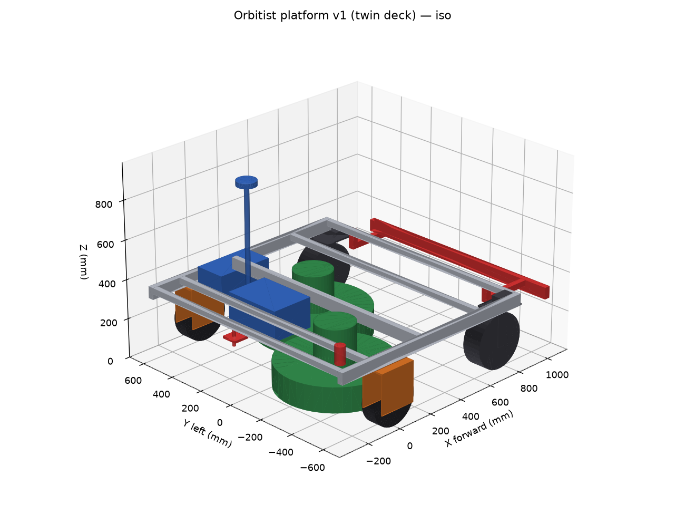

# CAD: platform v1 frame (code-based, build123d)

The robot is modelled in Python with [build123d](https://github.com/gumyr/build123d) (OpenCascade kernel). `params.py` holds every dimension in one place. `build.py` regenerates the STEP files, renders, flat-plate DXFs, cut list, and an engineering report.



## Files

| File | What it is |
|---|---|
| `params.py` | **All dimensions and masses.** Values marked `ESTIMATE` are typical sizes for parts we haven't bought; replace them with measurements. |
| `model.py` | Builds each part (frame, drive forks + hub motors, casters, mower decks, payload placeholders) |
| `build.py` | Exports everything to `exports/` and runs clearance checks |
| `strength.py` | Hand-calculation strength check → `exports/strength-report.md` |
| `exports/platform-v1-{single,twin}.step` | Full assembly. Open in Onshape (*Import*), FreeCAD, Fusion, or any STEP viewer. |
| `exports/*-{iso,top,side,front}.png` | Quick-look renders |
| `exports/*.dxf` | Flat patterns: drive-fork side plate (6 mm steel ×4), torque arm (5 mm steel ×4), frame gusset (×8) |
| `exports/strength-report.md` | Load cases, stresses and safety factors for forks, joints, and frame members |
| `exports/cut-list.md` | Extrusion lengths to cut |
| `exports/report.md` | Envelope, mass, CG, axle loads, tongue-weight limit, clearance checks |

## Configurations

- **single**: v1, one Ryobi deck centred just ahead of the drive axle (no scuffing during pivot turns).
- **twin**: v1.5, two decks **staggered** (rear-right, front-left) so their cuts overlap by 50 mm. Two decks side by side would leave an uncut strip, because the deck housing is wider than the blade. The frame is the same for both.

## Regenerate

```bash
cd hardware/cad
uv venv --python 3.12 .venv
uv pip install --python .venv/bin/python -r requirements.txt
.venv/bin/python build.py
.venv/bin/python strength.py
```

Commit the regenerated `exports/` together with the parameter change, so the repo stays readable without Python.

## What this model is (and isn't)

- **Layout model (v0).** Parts are simplified as boxes and cylinders, and the extrusions are solid bars without T-slots. Its job is to settle the envelope, positions, clearances, and weight distribution before buying parts.
- **Strength:** `strength.py` hand-checks the forks, joints, and members ([report](exports/strength-report.md)). It led to the torque arms, saddle-mounted forks, gussets, and the 30x60 member at x = 215. It's not FEA; the frame is simple enough that beam and plate checks catch the real risks.
- **Fasteners, brackets, wiring, and the deck hangers** are not modelled yet. They come after real parts are measured.

## Measure when parts arrive, then update `params.py`

1. Hub motor: tire OD and width, **dropout spacing** (shoulder to shoulder), **axle flats width**, axle length past each shoulder
2. Caster: wheel OD and width, trail, overall height from ground to the mounting plate
3. Ryobi deck (handle and wheels removed): housing outline, motor housing diameter and height, cutting height range, mass
4. Battery and enclosure dimensions

Licensed under [CERN-OHL-W-2.0](../../LICENSES/CERN-OHL-W-2.0.txt); the code in this folder is also available under [Apache-2.0](../../LICENSES/Apache-2.0.txt).
