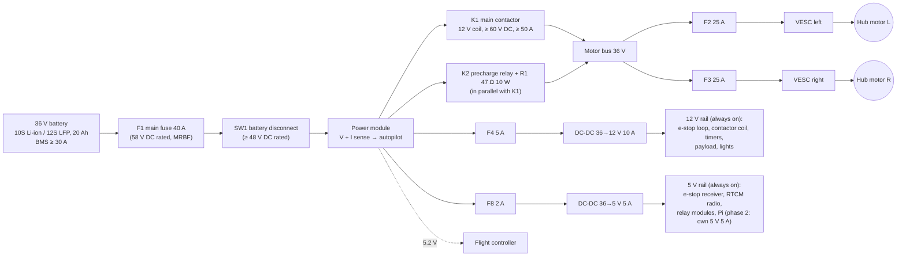
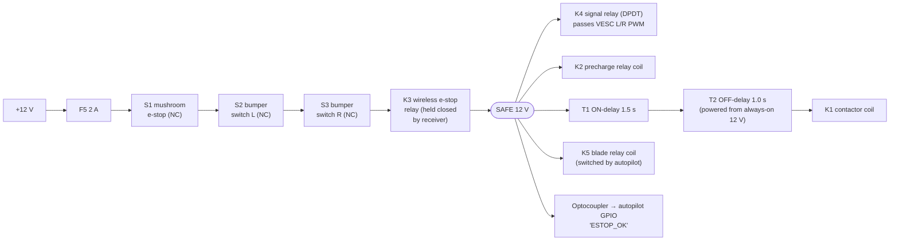
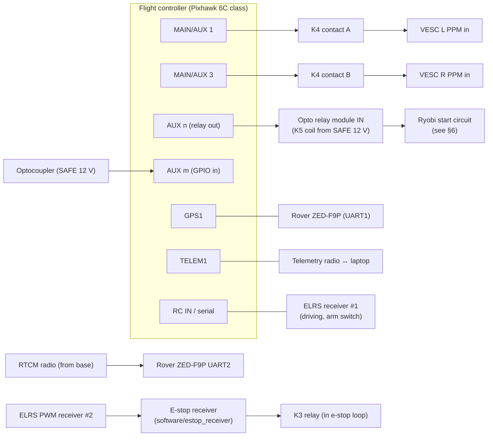

# Electrical design: platform v1

*Status: design for review before purchasing. Part numbers are examples; any part meeting the listed ratings works.*

The design follows four rules:

1. **Every fault fails toward "stopped".** The e-stop loop is normally-closed and in series, and every element in it must be actively *held* closed. A broken wire, a dead radio, or a crashed computer all stop the robot.
2. **Stop, then disconnect.** Cutting power to the motor controllers instantly makes hub motors *coast*. On grass at 1 m/s that's ~0.5 m of rolling, so the e-stop first commands **active braking** and then removes drive power about 1 s later. This is a "Category 1" stop in machine-safety terms.
3. **The safety chain doesn't depend on software.** ArduPilot also disarms on an e-stop, but the hardware path brakes and disconnects even if the autopilot is frozen or commanding full speed.
4. **The blade has its own cut-off**, which drops instantly with the e-stop loop no matter what the autopilot commands.

---

## 1. Power distribution

- **Electronics stay powered during an e-stop** (they're fed before K1), so the autopilot keeps logging, GPS keeps its fix, and the robot can report what happened. SW1 is the only thing that turns everything off.
- **Precharge:** VESCs have large input capacitors. Closing K1 onto empty capacitors arcs and eventually welds the contactor. K2 + R1 charge the capacitors first (τ ≈ 47 Ω × ~3000 µF ≈ 0.15 s), and K1 closes 1.5 s later.
- **Blade power is separate:** the Ryobi deck runs on its own Ryobi battery in phase 1. Only its control circuit passes through the robot (K5, below).

## 2. Safety chain (e-stop loop)

**What happens when the loop opens** (button pressed, bumper hit, transmitter off or out of range, wire broken):

| Time | Event | Independent of software? |
|---|---|---|
| 0 ms | **Blade relay K5 drops**, cutting the blade start circuit; the mower's own brake stops the blade (< 3 s) | ✅ |
| 0 ms | **K4 opens the PWM signal lines** to both VESCs | ✅ |
| ~100 ms | VESCs detect signal timeout and apply **timeout brake current**, braking the robot to a stop | ✅ (VESC firmware setting) |
| ~0–100 ms | Autopilot sees ESTOP_OK go low, disarms, sets the blade relay output off, logs the event | software, belt-and-braces |
| 1.0 s | T2 releases → **K1 opens, removing drive power** (and K2 has already dropped) | ✅ |

**What happens when the loop closes again:**
1. K2 precharges the VESC capacitors.
2. After 1.5 s, T1 → T2 → K1 closes the main contactor.
3. K4 reconnects the PWM lines, but the **robot does not move**: ArduPilot is disarmed and outputs no pulses (`MOT_SAFE_DISARM = 1`), so the VESCs keep braking. Moving again needs a deliberate re-arm on the transmitter's arm switch, and the blade needs a mission command.

**Stopping distance** (bumper design: see [`strength-report.md`](../cad/exports/strength-report.md#bumper-stopping-distance)): braking at ~3 m/s² after ~0.12 s of latency. That's why **v1 mows at 0.6 m/s**.

## 3. Signal wiring

- With K4 open, each VESC's PPM input must be **pulled to ground** (10 kΩ at the VESC end) so it sees "no signal" rather than noise.
- Run PWM and sensor wires as twisted pairs with their ground, away from motor phase wires.
- **One ground point:** the battery negative at the power module. Signal grounds follow their signals. Don't create a second path through the frame.

## 4. Fuses and wire

All fuses and fuse holders on the 36 V side must be **rated ≥ 58 V DC**. Ordinary automotive blade fuses are rated 32 V and may not interrupt a 42 V DC fault.

| Circuit | Fuse | Wire (silicone, chassis wiring) | Notes |
|---|---|---|---|
| Battery → SW1 → power module → K1 | F1 40 A (MRBF or Class T at the battery) | 10 AWG | As short as possible; F1 within 15 cm of the battery |
| Motor bus → each VESC | F2/F3 25 A (58 V ATO/MINI) | 12 AWG | Battery current limit per VESC is set to 14 A (§5) |
| Precharge K2 + R1 | inherent (R1 limits to < 1 A) | 18 AWG | R1: 47 Ω, 10 W, wirewound |
| DC-DC 12 V input | F4 5 A | 16–18 AWG | |
| DC-DC 5 V input | F8 2 A | 18 AWG | |
| E-stop loop (12 V) | F5 2 A | 20 AWG | Contactor coil ~0.3–0.5 A |
| Signals | — | 22–26 AWG twisted | |

Crimp, don't solder, anything that vibrates (use ferrules on screw terminals) and strain-relieve at the enclosure glands.

## 5. Settings that are part of the safety design

These live in configuration rather than wiring, but the design depends on them. Record them in `software/ardupilot/` and in the VESC config backups.

**VESC (each controller, VESC Tool):**

| Setting | Value | Why |
|---|---|---|
| Sensor mode | Hall sensors (FOC) | Smooth low-speed torque (design doc §5) |
| Battery current max | 14 A | Two VESCs stay under the 30 A BMS limit |
| Motor current max | ~50 A | ≈ 28 N·m with a typical torque constant of ~0.57 N·m/A. Keeps torque under the 40 N·m the forks and torque arms were checked for. Re-compute from the measured motor constant after VESC motor detection. |
| Motor current max brake | 30 A | Braking torque |
| App: PPM, **timeout 100 ms**, **timeout brake current 20 A** | — | This is what stops the robot when K4 cuts the signal or the autopilot dies |
| Battery cutoff start/end | Set for the pack chemistry | Protects the battery before the BMS has to |

**ArduPilot (Rover):** skid-steer outputs `SERVO1_FUNCTION = 73`, `SERVO3_FUNCTION = 74`; `MOT_SAFE_DISARM = 1` (no pulses when disarmed); arm with a **switch**, never stick-arming; RC and GCS failsafe → Hold; battery failsafe from the power module; geofence → Hold. A Lua script watches the ESTOP_OK input and disarms. The full parameter file comes with the autopilot setup.

## 6. Open item: Ryobi blade control (bench test)

How the robot switches the blade depends on the specific mower:

1. Open the handle wiring. Find the **bail switch** (the lever you hold) and the **start button**.
2. With a multimeter, measure the current through each while the mower runs (on a bench, blade removed or safely guarded).
   - **Low current (< 1 A):** these are signal inputs to the mower's brushless controller. K5 can be a small relay replacing the bail switch, plus a second relay or the same relay to "press" start (a ~0.5 s pulse from the autopilot, held by the bail relay).
   - **High current:** the bail switch carries motor power. K5 must be a DC contactor rated ≥ 60 V DC at the motor current.
3. Confirm that opening the bail circuit stops the blade within 3 s (blade brake).

Record the results in this file and update the K5 entry.

## 7. Parts list (electrical)

| Ref | Part | Rating / notes |
|---|---|---|
| F1 | Terminal-mount fuse (Blue Sea MRBF class) + holder | 40 A, 58 V DC |
| SW1 | Battery disconnect switch (Blue Sea m-Series class) | ≥ 48 V DC, ≥ 50 A |
| PM | Analog power module | ≥ 12S input, ≥ 60 A; supplies the flight controller |
| K1 | DC contactor, 12 V coil | ≥ 60 V DC, ≥ 50 A continuous (e.g. Albright SW60 / TE LEV100 class) |
| K2, R1 | 12 V automotive relay + 47 Ω 10 W resistor | Precharge |
| T1 | 12 V on-delay timer relay module | Adjustable, set 1.5 s |
| T2 | 12 V off-delay timer relay module | Trigger input + separate supply, set 1.0 s |
| K3 | 5 V relay module, active-HIGH | Driven by the e-stop receiver |
| K4 | 12 V DPDT signal relay | Gold-flashed contacts for low-level signals |
| K5 | 12 V-coil relay with opto-isolated 3.3 V input | Or a DC contactor; depends on the §6 bench test |
| S1 | 22 mm mushroom e-stop, twist-release, **NC** contact block | Mounted at the rear top, reachable from behind the robot |
| S2, S3 | Roller-lever microswitches, **NC** used | IP67 if available |
| — | Optocoupler module (12 V in → 3.3 V out) | ESTOP_OK to the autopilot |
| — | 2× DC-DC converters | 36→12 V 10 A, 36→5 V 5 A; input ≥ 60 V |
| — | 58 V fuse block + fuses | F2–F8 |
| — | E-stop receiver | Arduino Nano + ELRS PWM receiver ([software/estop_receiver](../../software/estop_receiver/README.md)) |

## 8. Commissioning tests

Do these in order, with the **drive wheels off the ground** and **no blade fitted** until step 6.

1. **Polarity and fuses:** with SW1 off, check every fuse is fitted. Measure the main bus with a meter before the first switch-on, using a current-limited bench supply if possible.
2. **Precharge:** loop closed → bus voltage rises within ~0.5 s → contactor clicks at ~1.5 s with no spark or arc sound.
3. **Each loop element** (S1, S2, S3, transmitter off, RUN switch down, a loop wire unplugged) must each:
   - drop the blade relay immediately,
   - make the wheels brake within ~0.1 s (spin them by hand first: they should resist),
   - open the contactor after ~1 s,
   - make the autopilot log "ESTOP" and disarm.
4. **No restart:** re-close the loop → the robot stays disarmed and the wheels stay braked until re-armed.
5. **Autopilot crash:** while driving with the wheels lifted, unplug the flight controller's power → the VESCs brake within 0.1 s from the signal timeout.
6. **Blade:** with the deck fitted and guarded, run the blade and hit the e-stop → the blade stops in < 3 s.
7. **On the ground:** at 0.6 m/s, push the bumper with a padded board → the robot stops within the bumper's travel.

Repeat steps 3 and 6 at the start of every mowing season and after any wiring change.
